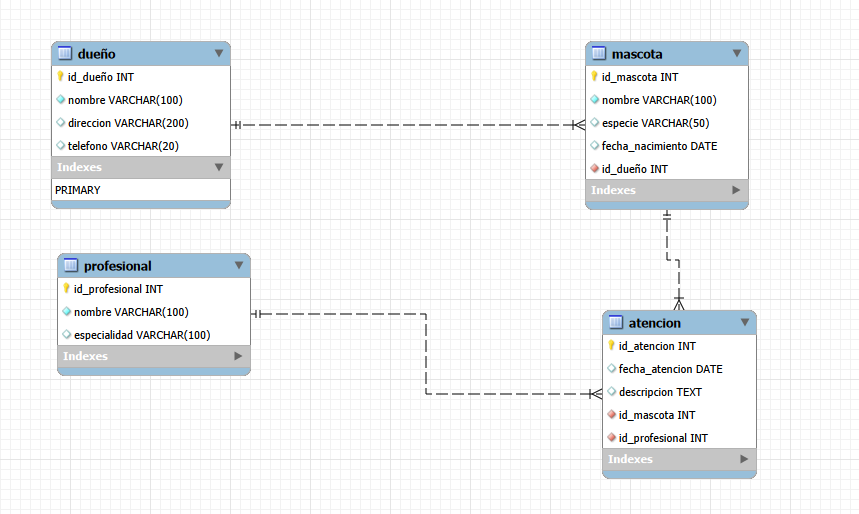

# Evaluacion final modulo 3 curso Full-stack Java 0033-1

En esta evaluacion final el objetivo fue crear una base de datos relacional para una consulta veterinaria con **integridad referencial** en mente , ademas de eso insertamos valores y creamos un **procedimiento con transacciones** que inserte datos a multiples tablas al hacer un ingreso de un paciente nuevo.

Ademas se agregaran consultas varias que nos ayudan a reforzar y demostrar nuestras habilidades de **construccion de Queries**.

## Creacion de tablas

  La estructura de las tablas creadas a traves de la query puede ser visualizada facilmente en este diagrama creado con MySQL Workbench.

  

  En el podemos apreciar tanto los campos de cada entidad asi como su tipo y las relaciones entre tablas (Tanto el tipo de relacion tienen y cuales son las llaves foraneas).

## Procedimiento de nuevo paciente

  Para el procedimiento de pacientes nuevos usamos una mezcla de logicas de transacciones y validaciones, esto para asegurarse que este cumpla con los parametros ACID y no contaminar nuestra base de datos ni que sea propensa a errores.

  Las 2 validaciones puestas en marcha para verificar son si:

  1. Existe el dueño de una nueva mascota a ingresar
  2. Una nueva atención no pueda ser ingresada con una fecha anterior al dia actual (Poniendonos en el caso de que esta informacion proviene de un formulario tomado por recepcion o se esta agendando un control a futuro)

  Codigo del procedimiento:

```
DELIMITER $$

CREATE PROCEDURE nuevo_ingreso (
	IN d_nombre VARCHAR(100),
    IN d_direccion VARCHAR(200),
    IN d_telefono VARCHAR(20),
	IN m_nombre VARCHAR(100),
    IN m_especie VARCHAR(50),
    IN m_fecha_nacimiento DATE,
	IN a_fecha_atencion DATE,
    IN a_descripcion TEXT,
    IN a_id_profesional INT
)

BEGIN
	DECLARE v_id_dueño INT;
    DECLARE v_id_mascota INT;

	DECLARE EXIT HANDLER FOR SQLEXCEPTION
    BEGIN
		ROLLBACK;
        RESIGNAL;
	END;
    
    START TRANSACTION;
    
    SELECT id_dueño INTO v_id_dueño
    FROM dueño
    WHERE nombre = d_nombre AND telefono = d_telefono
    LIMIT 1;
    
    IF v_id_dueño IS NULL THEN
		INSERT INTO dueño (nombre, direccion, telefono)
		VALUES (d_nombre, d_direccion, d_telefono);

    SET v_id_dueño = LAST_INSERT_ID();
    
	END IF;
    
    INSERT INTO mascota (nombre, especie, fecha_nacimiento, id_dueño)
    VALUES (m_nombre, m_especie, m_fecha_nacimiento, v_id_dueño);
    
    SET v_id_mascota = LAST_INSERT_ID();
    
    IF a_fecha_atencion < curdate()
    THEN 
		SIGNAL SQLSTATE '45000' SET MESSAGE_TEXT = 'Ingrese una fecha valida';
	ELSE
		INSERT INTO atencion (fecha_atencion, descripcion, id_profesional, id_mascota)
        VALUES (a_fecha_atencion, a_descripcion, a_id_profesional, v_id_mascota);
	END IF;
    
    COMMIT;
END $$

DELIMITER ;

```

Afortunadamente (o desafortunadamente para ellos) justo al momento de hacer e implementar este nuevo sistema ingresaron 2 pacientes y al ejecutar nuestro procedimiento a traves de la funcion CALL() pudimos ingresarlos a ellos, sus dueños y la atencion en una sola accion!

Les deseamos pronta mejoria


